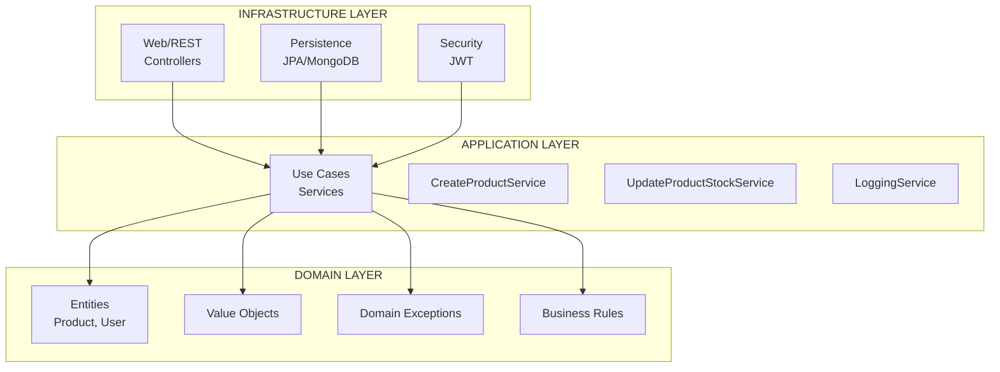
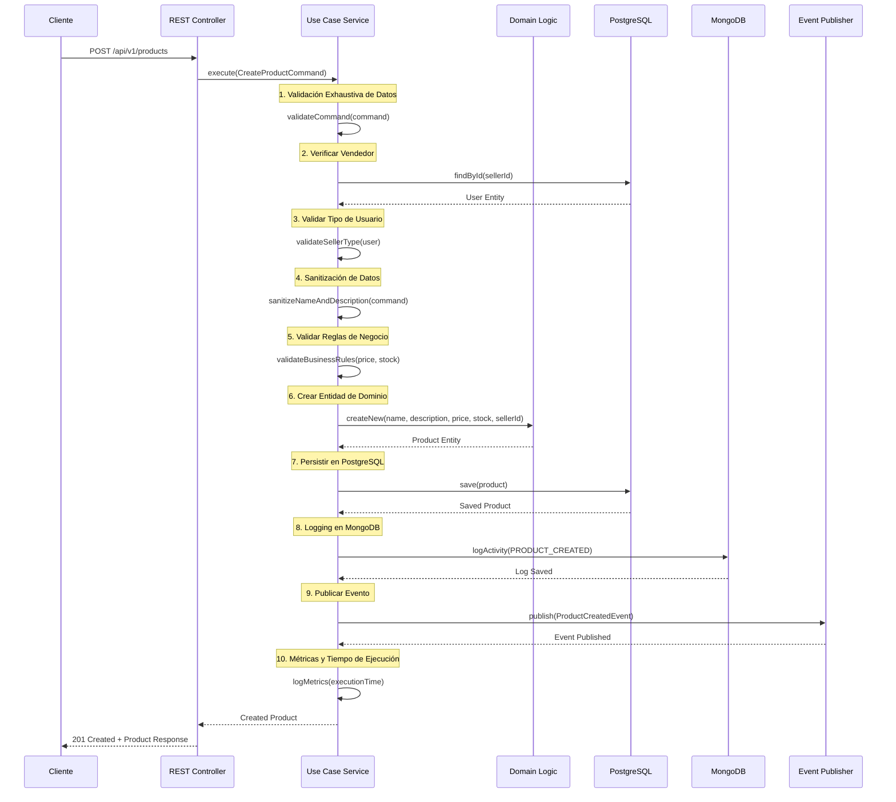
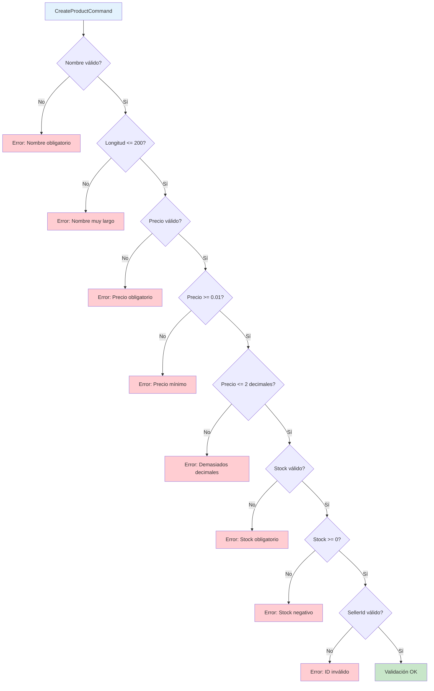
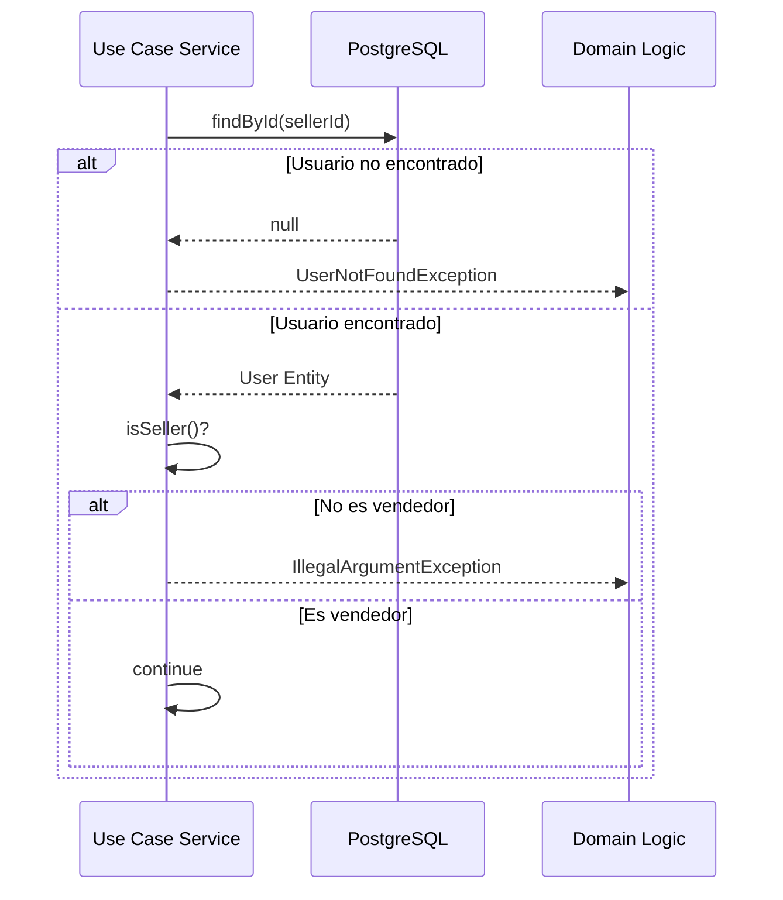
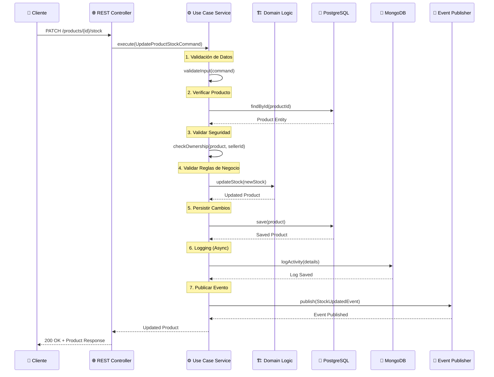
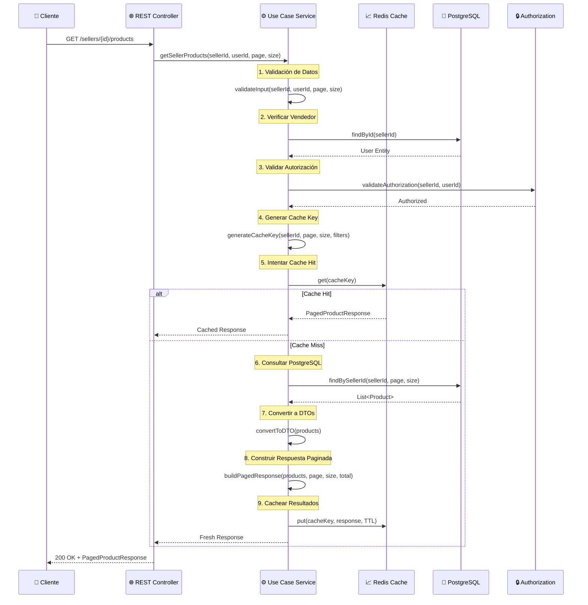
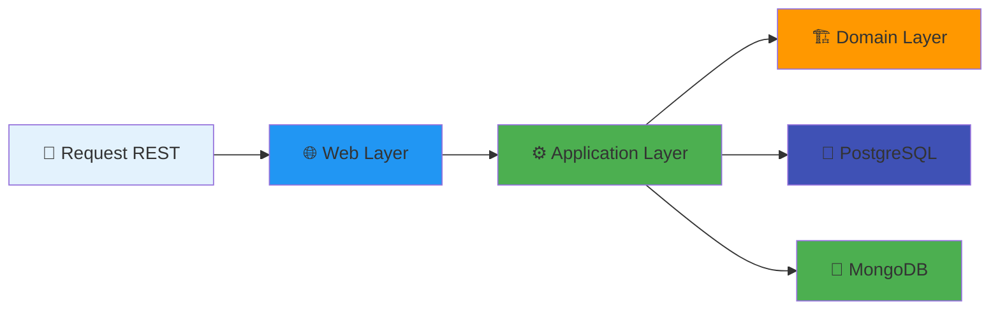

# 🛍 Marketplace API

> API RESTful para un marketplace con arquitectura hexagonal, desarrollada con Spring Boot, PostgreSQL y MongoDB.

[](https://www.oracle.com/java/)
[](https://spring.io/projects/spring-boot)
[](https://www.postgresql.org/)
[](https://www.mongodb.com/)
[](https://www.docker.com/)

## 📋 Tabla de Contenidos

- [🚀 Características](#-características)
- [🛠 Tecnologías](#-tecnologías)
- [🏗 Arquitectura](#-arquitectura)
- [🔄 Flujo del Caso de Uso: UpdateProductStock](#-flujo-del-caso-de-uso-updateproductstock)
- [📋 Requisitos Previos](#-requisitos-previos)
- [🚀 Instalación y Ejecución](#-instalación-y-ejecución)
- [⚙️ Configuración](#️-configuración)
- [📡 Endpoints API](#-endpoints-api)
- [📁 Estructura del Proyecto](#-estructura-del-proyecto)
- [🧪 Pruebas](#-pruebas)
- [🐳 Despliegue con Docker](#-despliegue-con-docker)
- [🔧 Solución de Problemas](#-solución-de-problemas)
- [📊 Estado Actual del Proyecto](#-estado-actual-del-proyecto)

## 🚀 Características

- ✅ **Arquitectura Hexagonal (Clean Architecture)** - Separación clara de responsabilidades
- ✅ **Spring Boot 4.0.5** - Framework moderno y eficiente
- ✅ **PostgreSQL** - Base de datos transaccional para datos críticos
- ✅ **MongoDB** - Base de datos NoSQL para logs y carritos temporales
- ✅ **JPA/Hibernate** - ORM para PostgreSQL
- ✅ **Spring Security** - Seguridad y autenticación (configurable)
- ✅ **Docker** - Contenedorización completa
- ✅ **Health Checks** - Monitoreo de servicios
- ✅ **Logging Estructurado** - Logs en MongoDB para auditoría
- ✅ **Validación de Datos** - Bean Validation y validaciones personalizadas
- ✅ **Gestión de Stock** - Caso de uso completo para actualización de inventario
- ✅ **Eventos de Dominio** - Publicación de eventos para desacoplamiento

## 🛠 Tecnologías

| Tecnología | Versión | Propósito | 🏷️ |
|------------|--------|-----------|------|
| Java | 25 | Lenguaje principal |  |
| Spring Boot | 4.0.5 | Framework principal |  |
| PostgreSQL | 16 | Base de datos transaccional |  |
| MongoDB | 7.0 | Base de datos NoSQL |  |
| Maven | 3.9+ | Gestor de dependencias |  |
| Docker | 24.0+ | Contenedorización |  |
| Lombok | 1.18.30 | Reducción de código boilerplate |  |
| MapStruct | 1.5.5 | Mapeo entre capas |  |

## 🏗 Arquitectura

El proyecto sigue **Arquitectura Hexagonal (Puertos y Adaptadores)**:



### 🔄 Flujo del Caso de Uso: CreateProduct

El caso de uso `CreateProduct` sigue un flujo completo para la creación de productos con validaciones exhaustivas:



#### 2.1 Validaciones Implementadas

##### Validación de Datos de Entrada


##### Validación de Usuario Vendedor


#### 2.2 Reglas de Negocio Específicas

##### Reglas de Validación
- **Precio Mínimo**: $0.01 (no permite productos gratuitos)
- **Precio Máximo sin Aprobación**: $1,000,000 (productos de lujo requieren aprobación especial)
- **Longitud Máxima Nombre**: 200 caracteres
- **Stock Inicial**: No puede ser negativo
- **Tipo de Usuario**: Solo usuarios de tipo SELLER pueden crear productos

##### Sanitización de Datos
```java
// Sanitización de nombre
String sanitizedName = name.trim().replaceAll("\\s+", " ");

// Sanitización de descripción
String sanitizedDescription = description.trim();
```

##### Monitoreo y Métricas
```java
long startTime = System.currentTimeMillis();
// ... lógica del caso de uso ...
long executionTime = System.currentTimeMillis() - startTime;
log.info("Producto creado en {} ms", executionTime);
```

#### 2.3 Manejo de Errores

##### Errores de Negocio
- **IllegalArgumentException**: Datos inválidos
- **UserNotFoundException**: Vendedor no existe
- **Logging estructurado**: Todos los errores se registran en MongoDB

##### Errores Técnicos
- **RuntimeException**: Errores inesperados con fallback
- **Logging de error crítico**: Se registra en MongoDB con nivel ERROR
- **Mensaje amigable**: Se retorna mensaje genérico al cliente

#### 2.4 Eventos y Logging

##### Eventos Publicados
```java
ProductCreatedEvent.builder()
    .productId(savedProduct.getId())
    .productName(savedProduct.getName())
    .price(savedProduct.getPrice())
    .stock(savedProduct.getStock())
    .sellerId(savedProduct.getSellerId())
    .sellerName(seller.getName())
    .sellerEmail(seller.getEmail())
    .createdAt(LocalDateTime.now())
    .eventType("PRODUCT_CREATED")
    .source("marketplace-api")
    .build();
```

##### Logs en MongoDB
- **PRODUCT_CREATED**: Creación exitosa
- **PRODUCT_CREATION_FAILED**: Error de negocio
- **PRODUCT_CREATION_ERROR**: Error técnico

#### 2.5 Características del Caso de Uso

- **Transaccional**: @Transactional asegura consistencia
- **Validación Robusta**: Múltiples capas de validación
- **Logging Completo**: Auditoría en MongoDB
- **Eventos Desacoplados**: Spring Events para microservicios
- **Métricas de Rendimiento**: Tiempo de ejecución
- **Sanitización de Datos**: Limpieza de entrada
- **Manejo de Errores**: Diferenciado por tipo

### 🔄 Flujo del Caso de Uso: UpdateProductStock

El caso de uso `UpdateProductStock` sigue un flujo completo y robusto:



### 🔄 Flujo del Caso de Uso: GetSellerProducts

El caso de uso `GetSellerProducts` permite obtener productos de un vendedor con filtros avanzados y caching:



## 📋 Requisitos Previos

### 📦 Software Necesario

| Software | Versión Mínima | 🎯 Propósito |
|----------|------------------|-------------|
|  | 25+ | Lenguaje principal |
|  | 3.9+ | Gestor de dependencias |
|  | 24.0+ | Contenedorización |
|  | Latest | Control de versiones |

### 🛠️ Herramientas Recomendadas

| Herramienta | Tipo | 🎯 Uso |
|------------|------|--------|
|  | IDE | Desarrollo principal |
|  | IDE | Alternativa ligera |
|  | API Testing | Probar endpoints |
|  | API Testing | Alternativa moderna |
|  | PostgreSQL UI | Administración |
|  | PostgreSQL UI | Alternativa |
|  | MongoDB UI | Administración |
|  | MongoDB UI | Alternativa |

## 🔧 Instalación y Ejecución

### 1. Clonar el repositorio

```bash
  git clone https://github.com/Programvr/marketplace.git
cd marketplace-api

```

### Iniciar PostgreSQL y MongoDB
```bash
  docker-compose up -d
```

### Verificar estado de los servicios
```bash
  docker-compose ps
```

### Ver logs en tiempo real
```bash
  docker-compose logs -f
```

### Limpiar y compilar el proyecto
```bash
  mvn clean compile
```

### Ejecutar pruebas
```bash
  mvn test
```

### Empaquetar la aplicación
```bash
  mvn package -DskipTests
```

### Ejecutar la aplicación
```bash
  java -jar target/marketplace-0.0.1-SNAPSHOT.jar
```

### O con Maven directamente
```bash
  mvn spring-boot:run
```

### Health check
curl http://localhost:8080/actuator/health

#### Respuesta esperada:
#### {"status":"UP"}

### Crear un producto
```bash
curl -X POST http://localhost:8080/api/v1/products \
  -H "Content-Type: application/json" \
  -d '{
    "name": "Laptop Gaming",
    "description": "High performance gaming laptop",
    "price": 1299.99,
    "stock": 5,
    "sellerId": 1
  }'
```

### Actualizar stock de un producto
```bash
curl -X PATCH http://localhost:8080/api/v1/products/1/stock \
  -H "Content-Type: application/json" \
  -H "X-Seller-Id: 1" \
  -d '{"quantityChange": 10}'
```

### Verificar stock actualizado
```bash
curl http://localhost:8080/api/v1/products/1
```
### Con Maven
```bash
mvn spring-boot:run -Dspring.profiles.active=docker
```

### Con JAR
```bash
java -jar target/marketplace-0.0.1-SNAPSHOT.jar --spring.profiles.active=docker
```

# ⚙️ Configuración

## Perfiles de Configuración		

| Perfil     | Descripción                                     | Archivo                       |
|------------|-------------------------------------------------|-------------------------------|
| default    | Configuración local con bases de datos locales  | application.yaml              |
| docker     | Configuración para contenedores Docker          | application-docker.properties |

# 📡 Endpoints API

## Productos

### 1. Crear Producto

```bash
POST /api/v1/products
Content-Type: application/json
```

#### Request Body:
```json
{
  "name": "Laptop Gaming",
  "description": "High performance gaming laptop",
  "price": 1299.99,
  "stock": 5,
  "sellerId": 1
}
```

#### Response (201 Created):
```json
{
  "id": 1,
  "name": "Laptop Gaming",
  "description": "High performance gaming laptop",
  "price": 1299.99,
  "stock": 5,
  "sellerId": 1,
  "status": "ACTIVE",
  "createdAt": "2026-03-31T12:00:00",
  "updatedAt": "2026-03-31T12:00:00"
}
```

### 2. Actualizar Stock de Producto

```bash
PATCH /api/v1/products/{productId}/stock
Content-Type: application/json
X-Seller-Id: {sellerId}
```

#### Headers:
- `X-Seller-Id`: ID del vendedor (obligatorio para seguridad)

#### Request Body:
```json
{
  "quantityChange": 10
}
```

#### Parámetros:
- `quantityChange`: Cambio en el stock (positivo para aumentar, negativo para disminuir)
- `productId`: ID del producto a actualizar (en la URL)

#### Response (200 OK):
```json
{
  "id": 1,
  "name": "Laptop Gaming",
  "description": "High performance gaming laptop",
  "price": 1299.99,
  "stock": 15,
  "sellerId": 1,
  "status": "ACTIVE",
  "createdAt": "2026-03-31T12:00:00",
  "updatedAt": "2026-03-31T14:30:00"
}
```

#### Errores comunes:
- `400 Bad Request`: Datos inválidos
- `404 Not Found`: Producto no encontrado
- `403 Forbidden`: Vendedor no es dueño del producto
- `422 Unprocessable Entity`: Stock resultaría negativo

#### Ejemplos de uso:

**Aumentar stock:**
```bash
curl -X PATCH http://localhost:8080/api/v1/products/1/stock \
  -H "Content-Type: application/json" \
  -H "X-Seller-Id: 1" \
  -d '{"quantityChange": 10}'
```

**Disminuir stock:**
```bash
curl -X PATCH http://localhost:8080/api/v1/products/1/stock \
  -H "Content-Type: application/json" \
  -H "X-Seller-Id: 1" \
  -d '{"quantityChange": -3}'
```

### 3. Obtener Producto por ID

```bash
GET /api/v1/products/{productId}
```

#### Response (200 OK):
```json
{
  "id": 1,
  "name": "Laptop Gaming",
  "description": "High performance gaming laptop",
  "price": 1299.99,
  "stock": 15,
  "sellerId": 1,
  "status": "ACTIVE",
  "createdAt": "2026-03-31T12:00:00",
  "updatedAt": "2026-03-31T14:30:00"
}
```

### 4. Listar Productos

```bash
GET /api/v1/products?page=0&size=10&sort=createdAt,desc
```

#### Query Parameters:
- `page`: Número de página (default: 0)
- `size`: Tamaño de página (default: 10)
- `sort`: Ordenamiento (formato: campo,dirección)

#### Response (200 OK):
```json
{
  "content": [
    {
      "id": 1,
      "name": "Laptop Gaming",
      "description": "High performance gaming laptop",
      "price": 1299.99,
      "stock": 15,
      "sellerId": 1,
      "status": "ACTIVE",
      "createdAt": "2026-03-31T12:00:00",
      "updatedAt": "2026-03-31T14:30:00"
    }
  ],
  "pageable": {
    "pageNumber": 0,
    "pageSize": 10,
    "sort": {
      "createdAt": "DESC"
    }
  },
  "totalElements": 1,
  "totalPages": 1,
  "first": true,
  "last": true
}
```
## Vendedores y Productos

### 1. Obtener Productos del Vendedor

```bash
GET /api/v1/sellers/{sellerId}/products
X-User-Id: {requestingUserId}
```

#### Headers:
- `X-User-Id`: ID del usuario que solicita (obligatorio para autorización)

#### Query Parameters:
- `page`: Número de página (default: 0)
- `size`: Tamaño de página (default: 10, máximo: 100)

#### Response (200 OK):
```json
{
  "products": [
    {
      "id": 1,
      "name": "Laptop Gaming",
      "description": "High performance gaming laptop",
      "price": 1299.99,
      "stock": 15,
      "sellerId": 1,
      "status": "ACTIVE",
      "createdAt": "2026-03-31T12:00:00",
      "updatedAt": "2026-03-31T14:30:00"
    }
  ],
  "currentPage": 0,
  "pageSize": 10,
  "totalItems": 1,
  "totalPages": 1,
  "hasNext": false,
  "hasPrevious": false
}
```

#### Ejemplo de uso:
```bash
curl -X GET "http://localhost:8080/api/v1/sellers/1/products?page=0&size=5" \
  -H "X-User-Id: 1"
```

### 2. Obtener Productos del Vendedor por Estado

```bash
GET /api/v1/sellers/{sellerId}/products/by-status?status={status}
X-User-Id: {requestingUserId}
```

#### Query Parameters:
- `status`: Estado del producto (ACTIVE, INACTIVE, DELETED)
- `page`: Número de página (default: 0)
- `size`: Tamaño de página (default: 10)

#### Ejemplo de uso:
```bash
curl -X GET "http://localhost:8080/api/v1/sellers/1/products/by-status?status=ACTIVE&page=0&size=5" \
  -H "X-User-Id: 1"
```

### 3. Obtener Productos del Vendedor por Rango de Precios

```bash
GET /api/v1/sellers/{sellerId}/products/by-price-range?minPrice={min}&maxPrice={max}
X-User-Id: {requestingUserId}
```

#### Query Parameters:
- `minPrice`: Precio mínimo (obligatorio, >= 0)
- `maxPrice`: Precio máximo (obligatorio, >= minPrice)
- `page`: Número de página (default: 0)
- `size`: Tamaño de página (default: 10)

#### Ejemplo de uso:
```bash
curl -X GET "http://localhost:8080/api/v1/sellers/1/products/by-price-range?minPrice=100&maxPrice=1000&page=0&size=5" \
  -H "X-User-Id: 1"
```

### 4. Obtener Productos del Vendedor por Rango de Fechas

```bash
GET /api/v1/sellers/{sellerId}/products/by-date-range?startDate={start}&endDate={end}
X-User-Id: {requestingUserId}
```

#### Query Parameters:
- `startDate`: Fecha de inicio (ISO DateTime, obligatorio)
- `endDate`: Fecha de fin (ISO DateTime, obligatorio, >= startDate)
- `page`: Número de página (default: 0)
- `size`: Tamaño de página (default: 10)

#### Ejemplo de uso:
```bash
curl -X GET "http://localhost:8080/api/v1/sellers/1/products/by-date-range?startDate=2026-03-01T00:00:00&endDate=2026-03-31T23:59:59&page=0&size=5" \
  -H "X-User-Id: 1"
```

#### Errores comunes:
- `400 Bad Request`: Parámetros inválidos (page < 0, size > 100, etc.)
- `401 Unauthorized`: Header X-User-Id faltante
- `403 Forbidden`: Usuario no autorizado (solo puede ver sus propios productos)
- `404 Not Found`: Vendedor no encontrado
- `422 Unprocessable Entity`: Parámetros de filtro inválidos (rango de precios/fechas incorrecto)

## 📁 Estructura del Proyecto

```mermaid
graph TD
    A[marketplace/] --> B[src/]
    B --> C[main/]
    C --> D[java/]
    D --> E[com/ConectaClick/marketplace/]
    
    E --> F[MarketplaceApplication.java]
    E --> G[domain/]
    E --> H[application/]
    E --> I[infrastructure/]
    
    G --> J[model/]
    G --> K[ports/]
    G --> L[exceptions/]
    
    J --> M[Product.java]
    J --> N[User.java]
    
    K --> O[inbound/]
    K --> P[outbound/]
    
    O --> Q[CreateProductUseCase.java]
    O --> R[UpdateProductStockUseCase.java]
    
    P --> S[ProductRepositoryPort.java]
    P --> T[UserRepositoryPort.java]
    
    L --> U[ProductDomainException.java]
    L --> V[UserNotFoundException.java]
    
    H --> W[services/]
    H --> X[persistence/]
    H --> Y[nosql/]
    H --> Z[web/]
    H --> AA[security/]
    
    W --> BB[CreateProductService.java]
    W --> CC[UpdateProductStockService.java]
    
    X --> DD[entities/]
    X --> EE[repositories/]
    X --> FF[adapters/]
    X --> GG[mappers/]
    
    DD --> HH[ProductEntity.java]
    DD --> II[UserEntity.java]
    
    EE --> JJ[JpaProductRepository.java]
    EE --> KK[JpaUserRepository.java]
    
    FF --> LL[ProductRepositoryAdapter.java]
    FF --> MM[UserRepositoryAdapter.java]
    
    GG --> NN[ProductPersistenceMapper.java]
    GG --> OO[UserPersistenceMapper.java]
    
    Y --> PP[entities/]
    Y --> QQ[repositories/]
    Y --> RR[services/]
    
    PP --> SS[ActivityLogEntity.java]
    
    QQ --> TT[ActivityLogRepository.java]
    
    RR --> UU[LoggingService.java]
    
    Z --> VV[controllers/]
    Z --> WW[dto/]
    Z --> XX[mappers/]
    
    VV --> YY[ProductController.java]
    
    WW --> ZZ[CreateProductRequest.java]
    WW --> AAA[ProductResponse.java]
    
    XX --> BBB[ProductRestMapper.java]
    
    AA --> CCC[SecurityConfig.java]
    
    style A fill:#e1f5fe
    style B fill:#f3f9ff
    style C fill:#90caf9
    style D fill:#81c784
    style E fill:#4caf50
    style F fill:#2196f3
    style G fill:#ffc107
    style H fill:#ff9800
    style I fill:#795548
    style J fill:#9c27b0
    style K fill:#607d8b
    style L fill:#e91e63
    style M fill:#f44336
    style N fill:#3f51b5
    style O fill:#2196f3
    style P fill:#ff5722
    style Q fill:#795548
    style R fill:#607d8b
    style S fill:#4caf50
    style T fill:#8bc34a
    style U fill:#cddc39
    style V fill:#ffeb3b
    style W fill:#ffc107
    style X fill:#ff9800
    style Y fill:#ff5722
    style Z fill:#e91e63
    style AA fill:#9c27b0
    style BB fill:#673ab7
    style CC fill:#3f51b5
```



### 📂 Desglose de Directorios

| 📁 Directorio | 🎯 Propósito | 📄 Archivos Principales |
|---------------|--------------|---------------------|
| **`src/main/java`** | Código fuente principal | `MarketplaceApplication.java` |
| **`domain/`** | 🏗️ Lógica de negocio pura | `Product.java`, `User.java` |
| **`application/`** | ⚙️ Casos de uso | `CreateProductService.java`, `UpdateProductStockService.java` |
| **`infrastructure/`** | 🔧 Adaptadores técnicos | `ProductController.java`, `ProductRepositoryAdapter.java` |
| **`persistence/`** | 🐘 PostgreSQL/JPA | `ProductEntity.java`, `JpaProductRepository.java` |
| **`nosql/`** | 🍃 MongoDB | `ActivityLogEntity.java`, `LoggingService.java` |
| **`web/`** | 🌐 Endpoints REST | `ProductController.java`, `ProductResponse.java` |
| **`resources/`** | ⚙️ Configuración | `application.yaml`, `application-docker.properties` |

### 🎯 Flujo de Paquetes



### 📋 Patrón Arquitectónico

| 🏗️ Capa | 🎯 Responsabilidad | 📦 Paquetes Clave |
|------------|------------------|-------------------|
| **Domain** | Reglas de negocio puras | `domain.model`, `domain.ports` |
| **Application** | Casos de uso y orquestación | `application.services` |
| **Infrastructure** | Adaptadores técnicos | `infrastructure.web`, `infrastructure.persistence` |
| **Persistence** | Acceso a datos | `infrastructure.persistence.repositories` |
| **NoSQL** | Logs y datos no estructurados | `infrastructure.nosql` |

# 🧪 Pruebas
## Ejecutar todas las pruebas
```bash
  mvn test
```
## Generar reporte de cobertura
```bash
  mvn jacoco:report
```

# 🐳 Despliegue con Docker
## Comandos básicos
```bash
  # Construir la imagen de la aplicación
docker build -t marketplace-app:latest .

# Levantar todos los servicios
docker-compose up -d

# Ver logs de todos los servicios
docker-compose logs -f

# Ver logs de un servicio específico
docker-compose logs -f app

# Ver estado de los servicios
docker-compose ps

# Detener servicios (conserva datos)
docker-compose down

# Detener y eliminar volúmenes (borra todos los datos)
docker-compose down -v

# Reiniciar un servicio
docker-compose restart app
```

# 🔍 Solución de Problemas
## Problema: Spring Security está protegiendo los endpoints.

## Solución: Deshabilitar seguridad temporalmente en application.yaml:

### properties
### spring.autoconfigure.exclude=org.springframework.boot.autoconfigure.security.servlet.SecurityAutoConfiguration

## Error: MongoDB connection refused
## Problema: MongoDB no está corriendo.

## Solución:

```bash
  # Verificar estado
docker ps | grep mongodb

# Ver logs
docker logs marketplace_mongodb

# Reiniciar servicio
docker-compose restart mongodb
```
## Error: PostgreSQL connection refused
## Problema: PostgreSQL no está corriendo.

## Solución:

```bash
# Verificar estado
docker ps | grep postgres

# Ver logs
docker logs marketplace_postgres

# Reiniciar servicio
docker-compose restart postgres
```
## Error: Port already in use
## Problema: El puerto 8080, 5432 o 27017 está ocupado.

## Solución: Cambiar puertos en docker-compose.yml:

```bash
  yaml
  ports:
- "8081:8080"   # API en puerto 8081
- "5433:5432"   # PostgreSQL en puerto 5433
- "27018:27017" # MongoDB en puerto 27018
```
## Error: MalformedInputException en archivos .properties
## Problema: Archivo de propiedades con codificación incorrecta.

## Solución: Guardar los archivos con codificación UTF-8 sin BOM.

## Error: Java version not supported
## Problema: Versión de Java incorrecta.

## Solución: Verificar la versión de Java:

```bash
  java -version
# Debe mostrar: openjdk version "25"
```
## Error: OutOfMemoryError
## Problema: Memoria insuficiente para Docker.

## Solución: Aumentar memoria en Docker Desktop:

### ° Windows/Mac: Docker Desktop → Settings → Resources → Memory
### ° Linux: Ajustar en Docker daemon}

# 👥 Autores
## Marlon Valbuena - Desarrollador Principal - @Programvr

---

## 📊 Estado Actual del Proyecto

### ✅ Funcionalidades Completas

#### 1. **CreateProductUseCase** - Creación de Productos
- ✅ Validación completa de datos de entrada
- ✅ Verificación de existencia de usuario vendedor
- ✅ Creación de entidad de dominio con reglas de negocio
- ✅ Persistencia en PostgreSQL con JPA
- ✅ Logging asíncrono en MongoDB
- ✅ Publicación de eventos de dominio
- ✅ Manejo robusto de excepciones
- ✅ Endpoint REST completo

#### 2. **UpdateProductStockUseCase** - Actualización de Stock ⭐
- ✅ Validación de datos de entrada (productId, quantityChange, sellerId)
- ✅ Verificación de existencia del producto
- ✅ Validación de seguridad (solo el dueño puede modificar)
- ✅ Validación de reglas de negocio (stock no puede ser negativo)
- ✅ Actualización de entidad de dominio
- ✅ Persistencia en PostgreSQL
- ✅ Logging en MongoDB (asincrónico)
- ✅ Publicación de evento `StockUpdated`
- ✅ Endpoint REST `PATCH /api/v1/products/{id}/stock`

#### 3. **GetSellerProductsUseCase** - Obtener Productos de Vendedor
- ✅ Validación completa de datos de entrada (sellerId, requestingUserId, paginación)
- ✅ Verificación de existencia del vendedor
- ✅ Validación de autorización granular (solo propietario puede ver sus productos)
- ✅ Caching inteligente con Redis (TTL 5 minutos)
- ✅ Múltiples filtros: por estado, rango de precios, rango de fechas
- ✅ Paginación eficiente (máx 100 items por página)
- ✅ Transformación de entidades a DTOs
- ✅ Construcción de respuestas paginadas con metadatos
- ✅ 4 endpoints REST especializados
- ✅ Métricas de rendimiento optimizadas

### 🔄 Flujo de Datos

```mermaid
flowchart LR
    A[📱 Request REST] --> B[🌐 Web Layer]
    B --> C[⚙️ Application Layer]
    C --> D[🏗 Domain Layer]
    C --> E[🐘 PostgreSQL]
    C --> F[🍃 MongoDB]
    
    style A fill:#e3f2fd
    style B fill:#2196f3
    style C fill:#4caf50
    style D fill:#ff9800
    style E fill:#3f51b5
    style F fill:#00bcd4

### 📝 Logs y Auditoría

- ✅ **MongoDB**: Todos los cambios de stock se registran
- ✅ **Asincrónico**: El logging no bloquea el flujo principal
- ✅ **Estructurado**: Formato consistente para auditoría
- ✅ **Fallback**: Si MongoDB falla, loguea a consola

### 🚀 Despliegue

- ✅ **Docker Compose**: Todos los servicios funcionan
- ✅ **Health Checks**: PostgreSQL y MongoDB saludables
- ✅ **Configuración**: Perfiles docker y local funcionando
- ✅ **Red Interna**: Comunicación entre contenedores

### 📋 Pruebas Recomendadas

```bash
# 1. Probar creación de producto
curl -X POST http://localhost:8080/api/v1/products \
  -H "Content-Type: application/json" \
  -d '{"name":"Test Product","price":100.00,"stock":10,"sellerId":1}'

# 2. Probar actualización de stock
curl -X PATCH http://localhost:8080/api/v1/products/1/stock \
  -H "Content-Type: application/json" \
  -H "X-Seller-Id: 1" \
  -d '{"quantityChange": 5}'

# 3. Verificar logs en MongoDB
docker exec marketplace_mongodb mongosh --eval "
  db.activity_logs.find({action: 'UPDATE_STOCK'}).sort({createdAt: -1}).limit(5)
"
```

### 🎯 Próximos Pasos

- [ ] **Implementar validación de JWT** para seguridad real
- [ ] **Agregar endpoints de búsqueda y filtrado** de productos
- [ ] **Implementar carrito de compras** con MongoDB
- [ ] **Agregar tests unitarios** para UpdateProductStockUseCase
- [ ] **Configurar CI/CD** con GitHub Actions
- [ ] **Documentación OpenAPI/Swagger** automática

### 🐛 Issues Conocidos

- ⚠️ **MongoDB Connection**: Si falla la conexión, el sistema hace fallback a logging en consola
- ⚠️ **Spring Security**: Actualmente en modo desarrollo (password generado)
- ⚠️ **Validación de Stock**: No permite stock negativo (diseño intencional)

---

## 📞 Soporte

Para preguntas o soporte sobre este proyecto:
- 📧 **Issues**: [GitHub Issues](https://github.com/Programvr/marketplace/issues)
- 📧 **Email**: marlon.valbuena@example.com
- 💬 **Discusión**: [GitHub Discussions](https://github.com/Programvr/marketplace/discussions)

---

*Última actualización: 6 de abril de 2026*